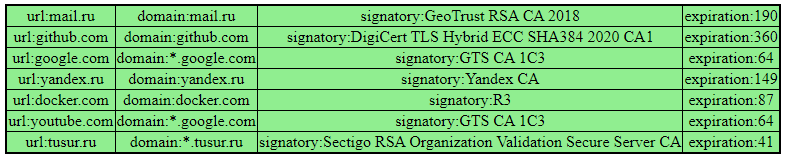

# CertChecker
Сервис мониторинга сертификатов

Сервис позволяет получать информацию о сертификате по url сайта, данный метод добовляю в zabbix для мониторинга и алертинга. request -> http://micro_service:8080/?url=mail.ru

```JSON
{"domain":"mail.ru",
"signatory":"GeoTrust RSA CA 2018",
"published":"26.08.2021",
"expires":"26.09.2022",
"curent_date":"06.02.2022",
"expiration":232}
```

Через метод monitor_json можно добавить список серверов на оснований которого вернет json с результатом проверки request -> http://micro_service:8080/?monitor_json

```JSON
[
{"mail.ru":["mail.ru","GeoTrust RSA CA 2018",190]},
{"github.com":["github.com","DigiCert TLS Hybrid ECC SHA384 2020 CA1",360]},
{"google.com":["*.google.com","GTS CA 1C3",64]},
{"yandex.ru":["yandex.ru","Yandex CA",149]},
{"docker.com":["docker.com","R3",87]},
{"youtube.com":["*.google.com","GTS CA 1C3",64]},
{"tusur.ru":["*.tusur.ru","Sectigo RSA Organization Validation Secure Server CA",41]}
]
```


Через метод monitor можно добавить список серверов на оснований которого будет сформирована таблица с информацией о сертификатах для запрошенный url. Записи о сертификате который истекает через 30 дней будут подсвечиваются красным, остальные зеленым. request -> http://micro_service:8080/?monitor



* Перед запусом измените server_name сайта на свой -> конфиг nginx\conf\site.conf
* По умолчанию все ответы с кодо 201 кешируются на 30 минут, для отключения закоментируюте деректины fastcgi_cache* -> конфиг nginx\conf\site.conf
* Проброс портов можно изменить в docker-compose.yml, деректива ports
* Для запуска docker-compose up -d
* Список сайтов передается через файл src/monitor.conf -> разделитель для имен пробел, имена передавать без https
